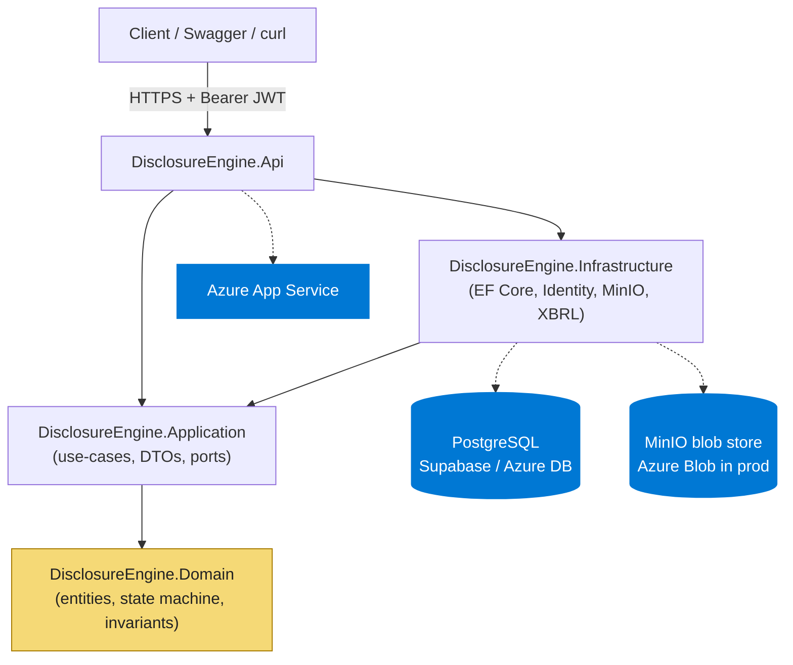
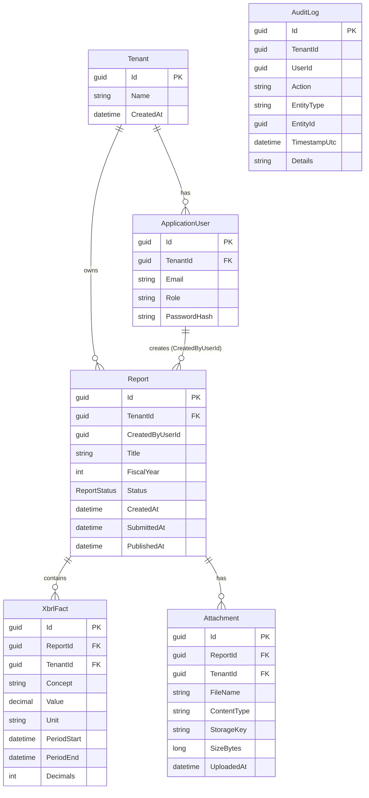
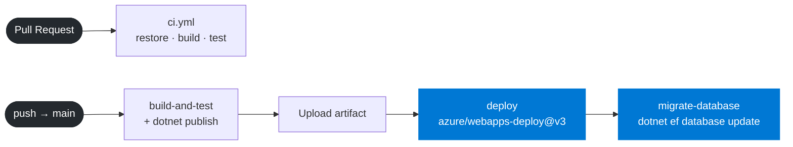

# Disclosure Engine

[](https://github.com/Aziiz01/disclosure-engine/actions/workflows/ci.yml)
[](https://dotnet.microsoft.com/en-us/download/dotnet/8.0)

> Multi-tenant ASP.NET Core 8 Web API for corporate financial disclosure workflows with XBRL tagging.

A study of the architecture behind regulated financial-reporting SaaS: tenant-isolated data, machine-readable XBRL tagging, an immutable audit trail, and a strict `Draft → Submitted → Published` workflow enforced in the domain — built against **ESEF**, **CSRD**, and Dutch **SBR** constraints.

**▶ Live API (Swagger UI):** <https://disclosure-engine.fly.dev/swagger/index.html>

---

## Tech stack

| Layer | Choice |
|---|---|
| Language / framework | C# 12 · ASP.NET Core 8 (Web API, controllers) |
| ORM / database | EF Core 8 · PostgreSQL 15 (Supabase) |
| Auth | ASP.NET Identity · JWT bearer (HS256), `tenant_id` claim |
| Blob storage | MinIO (S3-compatible) via Docker; Azure Blob as production target |
| XBRL | `System.Xml.Linq` parser, taxonomy-agnostic |
| Tests | xUnit · FluentAssertions 6.12.2 · Moq |
| CI/CD | GitHub Actions → Azure App Service + Azure DB (committed, secrets-gated) |

---

## Architecture



`Domain` has zero project references and compiles without EF Core or ASP.NET. `Application` owns the port interfaces; `Infrastructure` provides adapters; `Api` is the composition root.

## Domain model



`Report.Status` is a state machine enforced inside the entity. Controllers call the domain method; the global exception middleware maps `InvalidOperationException` → 409. Every `Added`/`Modified` row triggers an `AuditLog` insert in the same transaction via `AuditingInterceptor` (which redacts `PasswordHash`).

## CI/CD pipeline



Azure stages are gated on `AZURE_WEBAPP_PUBLISH_PROFILE` / `AZURE_SQL_CONNECTION_STRING` secrets — empty secret emits a `::warning::` and exits cleanly. The pipeline is committed and wired; it activates the day those secrets are populated. Swapping MinIO/Supabase for Azure Blob/DB is a single DI registration change, since every external dependency sits behind a port interface.

---

## Run it locally

```powershell
git clone https://github.com/Aziiz01/disclosure-engine.git
cd disclosure-engine

# Secrets (one block).
dotnet user-secrets set "ConnectionStrings:Default"           "Host=...;Port=5432;Database=postgres;Username=...;Password=...;SSL Mode=Require;Trust Server Certificate=true" --project src/DisclosureEngine.Api ; `
dotnet user-secrets set "ConnectionStrings:DefaultMigrations" "Host=...;Port=5432;Database=postgres;Username=...;Password=...;SSL Mode=Require;Trust Server Certificate=true" --project src/DisclosureEngine.Api ; `
dotnet user-secrets set "Jwt:Key"                              "a-long-random-256-bit-secret-please-replace-me" --project src/DisclosureEngine.Api ; `
dotnet user-secrets set "Minio:Endpoint" "localhost:9000" --project src/DisclosureEngine.Api

# MinIO (creates the disclosure-engine-attachments bucket automatically).
docker compose up -d minio minio-setup

# Migrate and run.
dotnet ef database update --project src/DisclosureEngine.Infrastructure --startup-project src/DisclosureEngine.Api ; `
dotnet run --project src/DisclosureEngine.Api
```

Swagger UI: <https://localhost:7199/swagger>. MinIO console: <http://localhost:9001> (`minioadmin` / `minioadmin`). Two users are seeded in `Development`:

| Email | Password | Tenant | Role |
|---|---|---|---|
| `admin@acme.test`      | `Admin@123!`    | Acme Corp NV  | Admin |
| `reporter@globex.test` | `Reporter@123!` | Globex BV     | Reporter |

---

## What I learned

- **Supabase's two poolers don't fit EF Core uniformly.** The transaction pooler (6543) fights Npgsql's connection multiplexing and was killing the seed's multi-statement transaction before commit. Both connection strings ended up on the session pooler (5432); the two config keys stay distinct so splitting them back later is a one-line change.
- **`AddIdentity` doesn't silently yield to `AddAuthentication(JwtBearer)`.** Its cookie scheme was winning `[Authorize]` challenges and returning 302 to `/Account/Login` instead of 401. Fix: pin every default-scheme slot to `JwtBearer` after `AddIdentity`; the cookie scheme stays registered so `SignInManager` still works.
- **XBRL 2.1 is deep; scope it and say so.** Dimensional contexts, compound units, footnote XLinks — out of scope. Single-measure units, date-range contexts, "any element with contextRef is a fact" — in. ~130 LOC, zero new packages, validation errors surfaced not swallowed.
